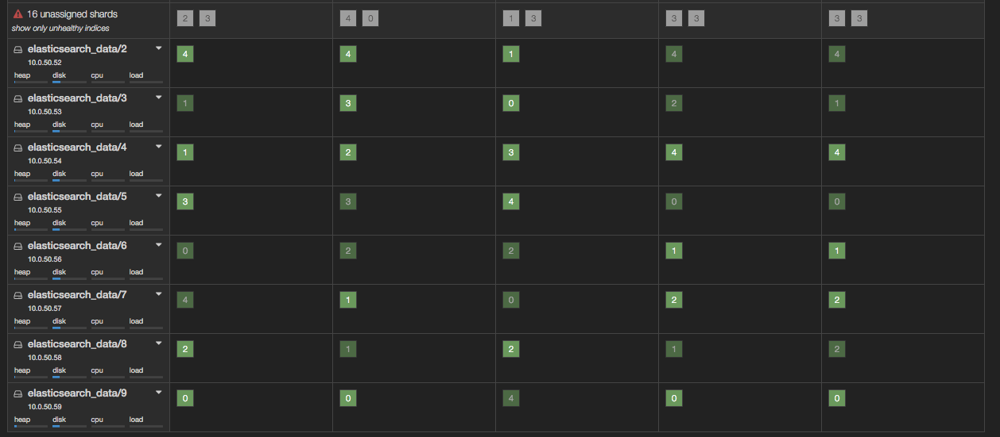

# Troubleshooting ElasticSearch

## Notes

* Elasticsearch has no notion of a missing node. A node is either among the known nodes or it isn't. This makes detecing why a cluster is in a bad state difficult.
* As long as at least 1 copy of each shard is intact the cluster keeps working. For example, if the number of replicas is set to 1 then losing 1 node won't cause any immediate problems. The cluster will automatically recreate the missing shards and will go back to green, after which the fact that a data node is missing might go unnoticed.

## Cluster states

### Green

All indices and shards are in a good state

### Yellow

Some shards are missing but their replicas are intact, the cluster is working on recreating missing data. While the cluster is in yellow state data can still be stored and searched.

Generally speaking when the cluster is yellow it will get back to green sooner or later. Depending on the size of the indices it could take a long time.

Things to do:
* Look for missing data nodes. A data node might have gone away and the cluster is recreating the data that was stored on it from replicas on other nodes.
* Nothing. If all data nodes are accounted for then wait until the cluster sorts itself out.

### Red

At least one index is missing shards and all their replicas. Data replication is impossible. **While the cluster is red (at least 1 index is red) data can not be stored in the failing indices** and querying may return results based on partial data.

When the cluster is red it can't fix itself without intervention (unless BOSH resurrects missing VMs)

Things to do:
* Look for missing data nodes. If nodes were found to be unable to join the cluster try restarting them.
* Try to find the corrupted index.

### Finding broken shards

The plugin [kopf](https://github.com/lmenezes/elasticsearch-kopf) gives a nice overview of indices and shards.



Here we can see that `logs-unparsed-2016.02.06` and `logs-unparsed-2016.02.07` are missing 2 copies of shard 3. Since the current index configuration is 1 replica set, we are missing all copies of these shards. We can either try to find out what happened to the missing data (missing nodes) or delete the index effectively losing data.

**The cluster won't start storing new documents in the red indices until the error is fixed one way or the other.**

The kopf UI may be difficult to comprehend if there are lots of data nodes and hundreds of indices/shards in different states. Alternatively, Using the cat API to get index info is also a solution.

```
$ curl -s MASTER_NODE:9200/_cat/indices?v
health status index                    pri rep docs.count docs.deleted store.size pri.store.size
green  open   .marvel-es-2016.02.08      1   1     396079          520      286mb        143.5mb
yellow open   logs-unparsed-2016.02.10   5   1   64769069            0       31gb         19.4gb
red    open   logs-unparsed-2016.02.08   5   1   32372451            0     19.9gb          9.9gb
```

### Listing ongoing opeartions

When the cluster is doing something to shards (initialise,relocate,etc) it can come in handy to get an idea what's going on in the cluster. Currently ongoing shard operations can be listed using the cat API.

```
$ curl MASTER_NODE:9200/_cat/recovery?v
index                                         shard time    type       stage     source_host target_host repository snapshot files files_percent bytes       bytes_percent total_files total_bytes translog translog_percent total_translog
logstash-syslog-2016.02.08                    0     6881    relocation translog  10.0.43.27  10.0.43.79  n/a        n/a      17    100.0%        2771021     100.0%        17          2771021     1000     70.0%            1396
```
